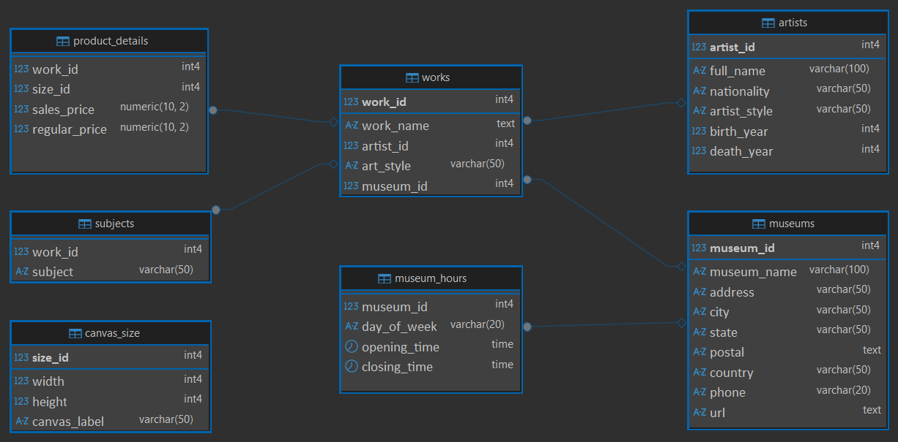

# Discovering Patterns in Paintings, Artists, and Museums with PSQL

---

## Database Setup

The analysis was performed on a PostgreSQL database. The setup process included the following steps:

1. Creating a new database named **`Paintings`**.
2. Importing the raw data from CSV files into their respective tables within the database.
3. Updating the tables by defining **primary and foreign keys** to establish relationships and ensure data integrity.

## Database Schema

The queries operate on the following key tables and their relationships:

* **`artist`**: Contains artist details.
* **`work`**: Contains painting details.
* **`museum`**: Contains museum details.
* **`museum_hours`**: Stores daily opening and closing times for museums.
* **`product_details`**: Links paintings to pricing information.
* **`subject`**: Lists the subjects of each painting.
* **`canvas_size`**: Details about the paintings canvas.

---

## Overview

This analysis explored key statistics and insights from the **Paintings Project** PostgreSQL database, covering artists, museums, artworks, and pricing information.

---

## Artists

* **Total Artists:** 421  
* **Top Nationalities:** French (115), American (83), Dutch (68), English (44), Italian (26)  
* **Most Common Art Styles:** Baroque (54), Impressionist (42), Realist (35), Expressionist (25), Rococo (23)

---

## Museums

* **Total Museums:** 57  
* **Top Countries by Museum Count:** USA (25), France (7), UK (5), Netherlands (4)  
* **Open 7 Days a Week:** 17 museums including *The Metropolitan Museum of Art*, *Rijksmuseum*, and *The Tate Gallery*

---

## Artworks

* **Total Paintings:** 14,716  
* **Available in Museums:** 4,553  
* **Not Available (Private/Unknown):** 10,163  
* **Top 10 Art Styles by Work Count:** Impressionism, Post-Impressionism, Realism, Baroque, Expressionism, Rococo, Romantic, Hudson River School, Fauvism, Classicism  

---

## Pricing Insights

* **Most Expensive Painting:** *A Street in Paris in May 1871* (\$2,235.00)  
* **Least Expensive Painting:** *Still Life with Fruit, Oysters, and a Porcelain Bowl* (\$75.00)

---

## Key Takeaways

The dataset shows strong representation of **European and American art movements**, with **Impressionism** leading in volume.  
The **USA hosts the highest number of museums**, and a subset operate **daily**, highlighting active public access.  
Pricing data spans a wide range, indicating significant variation in artistic and market valuation.

---

## Author

**Name**: *Maria Egbuna*  
**Date**: *2025-10-30*  
